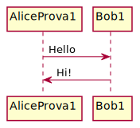
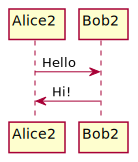
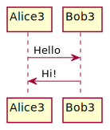

# git_dojo_repo
GIT DOJO repo is useful repo training

forzaaaa

dajeee - BEFORE

Regular **Markdown** here.

<!-- 
@startuml firstDiagram

Alice1 -> Bob1: Hello
Bob1 -> Alice1: Hi!
		
@enduml 
-->

dajeee - AFTER1

@startuml secondDiagram

Alice2 -> Bob2: Hello
Bob2 -> Alice2: Hi!
		
@enduml

dajeee - AFTER2

@startuml thirdDiagram

Alice3 -> Bob3: Hello
Bob3 -> Alice3: Hi!
		
@enduml

dajeee - AFTER3
